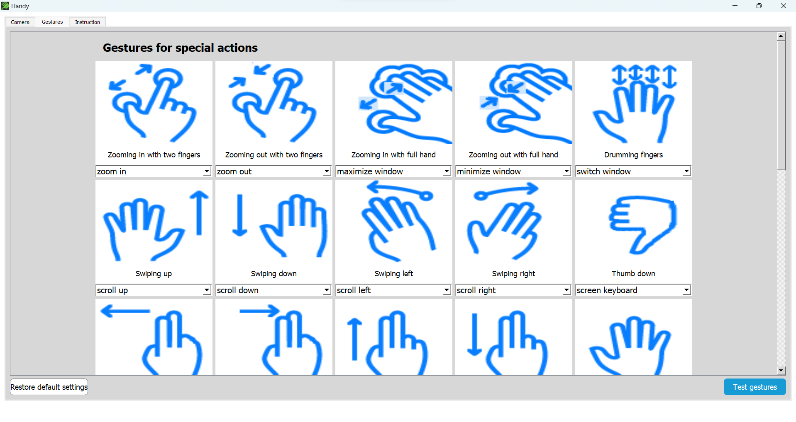
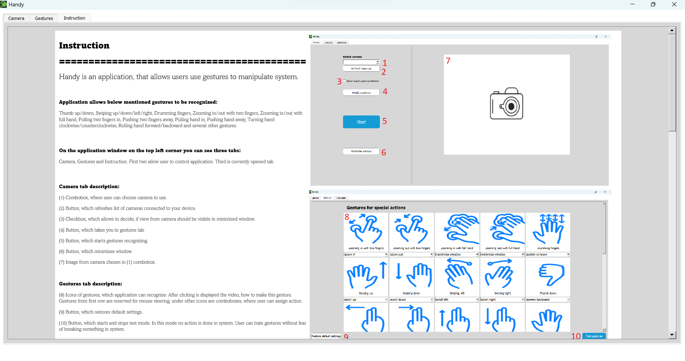

# Sterowanie interfejsem systemu operacyjnego przy pomocy gestów

Projekt aplikacji umożliwiającej sterowanie systemem operacyjnym Windows przy pomocy gestów. Aplikacja wykorzystuje bibliotekę zawierającą sieć neuronową, umożliwiająca detekcję 25 gestów dynamicznych oraz bibliotekę Mediapipe, która pozwala na wykrycie poszczególnych części dłoni. Aplikacja umożliwia między innymi minimalizację, maksymalizację okien, sterowanie głośnością, sterowanie jasnością ekranu, przybliżanie, oddalanie ekranu, przełączanie pomiędzy oknami oraz sterowanie położeniem kursora myszki na ekranie przy pomocy gestów. W repozytorium brakuje pliku zawierającego sieć neuronową, wymaganego do uruchomienia. Wersja dystrybucyjna, możliwa do pobrania i zainstalowania znajduje się pod poniższym linkiem.

Link do exe: https://drive.google.com/drive/folders/1T1_y1KNwwsiE7yotEShg7kMV8X9AknPA 

Wygląd aplikacji

